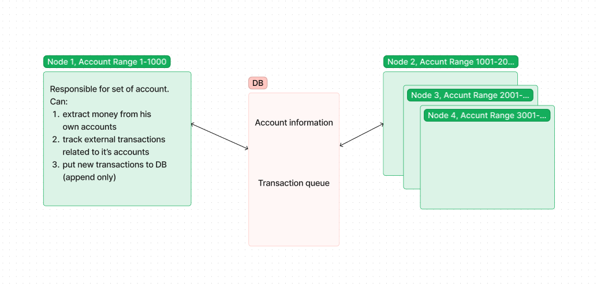

## Solution notes
I'm trying to fit in "1 day to develop" solution and I choose not optimal, but less code approaches.

Main problem here is what we are trying to implement in one service close-to-prod solution which always is not 1 service.
Because of that I allow myself (maybe wrongly) a few simplifications:

    1. It's a valid scalable solution, but communication between nodes is Db. AccountsRange could be set in configuration. In "regular world scenario" it would be a mq or rest solution.
    2. I assume what then request come to controller, I'm responsible for this outcome account and no one else does not.

That basically mean what we should have balancing router(or service) which should have sharding function depend on account id.
If it's not the case, all income requests should be redirected, but this is not optimal (because you're wasting resources of 2 instances of services on that for one request).

## Flow (happy case), in few words is:
    -2. Get request
    -1. ssl termination, auth.
     0. route to right node which is responsible for this account(account range)
     1. Get request <-- implementation starting from here.
     2. validate request
     3. block required amount on donor account
     4.
     4.1 a)crate a request to another node (which is responsible for second account) to insrease amout on the other side.
         b) mark transaction is complete (in db)
	     c) commit blocked amount in first node or release it if failed.
     4.2 a) create request to outside submission service.
         b) track response
	     c) commit blocked amount in first node or release it if failed.

## Architecture:

One node is responsible for some set of accounts(In simple case - for all of them). We receive request on node which is responsible for account from.
Consistency is provided by db (not fast, but solid).
TransactionalScopes:
1. block amount on account1 + add transaction
2. mark transaction as complete stage1 + add qty to account2  (state still IN_PROGRESS)
3. mark transaction as complete stage2 + release the blocked amount or submit it. (after, state = COMPLETE)

## Gray area: 
WithdrawalServiceStub does not persist it's state. In case of kill-switch it state will be lost and transaction will have inconsistency in state. 

## Notices:
1: No read/write API splitting because tracking is trivial.
2: Distributed locks system also was banned because it will need at least 2 services
3: Solution with rest or mq will provide much more performance, but with more edge cases and gray areas because they are not transactional.
4: If one node is down, we will continue to work with subset of accounts. In this case better to have few hot-spot instances to reduce downtime.